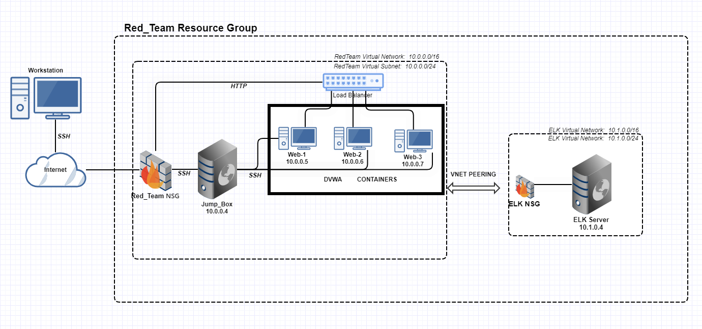

## Automated ELK Stack Deployment

The files in this repository were used to configure the network depicted below.



These files have been tested and used to generate a live ELK deployment on Azure. They can be used to either recreate the entire deployment pictured above. Alternatively, select portions of the YAML file may be used to install only certain pieces of it, such as Filebeat.

  - [YML Playbooks](https://github.com/Zronalmario/Project_13/tree/main/Ansible_Playbooks)

This document contains the following details:
- Description of the Topology
- Access Policies
- ELK Configuration
  - Beats in Use
  - Machines Being Monitored
- How to Use the Ansible Build


### Description of the Topology

The main purpose of this network is to expose a load-balanced and monitored instance of DVWA, the D*mn Vulnerable Web Application.

Load balancing ensures that the application will be highly available, in addition to restricting traffic to the network.
-  Load balancers distribute traffic evenly across the servers and mitigates DoS attacks.
- It also offers a health probe function to regularly check all the machines behind the load balancer and machines with issues will not receive traffic from the load balancer.
- Advantage of a Jump box is that it prevents all Web servers from being exposed to the public. 


Integrating an ELK server allows users to easily monitor the vulnerable VMs for changes to the filesystem and system database.

- Filebeat is a lightweight, open source program that can monitor log files and send data to servers.
- Metricbeat is a lightweight shipper that periodically collects metrics from the operating system and from services running on the server. 


The configuration details of each machine may be found below.

| Name     | Function | IP Address | Operating System |
|----------|----------|------------|------------------|
| Jump Box | Gateway  | 10.0.0.4   | Linux            |
| ELK      | Monitor  | 10.1.0.4   | Linux            |
| Web-1    | Webserver| 10.0.0.5   | Linux            |
| Web-2    | Webserver| 10.0.0.6   | Linux            |
| Web-3    | Webserver| 10.0.0.7   | Linux            |
### Access Policies

The machines on the internal network are not exposed to the public Internet. 

Only the Jump box machine can accept connections from the Internet. Access to this machine is only allowed from the Administrator's IP address.

Machines within the network can only be accessed by the admin.
-  Jump box is the only one allowed to access ELK VM thru ssh and has an IP address of  10.0.0.4

A summary of the access policies in place can be found in the table below.

| Name     | Publicly Accessible | Allowed IP Addresses |
|----------|---------------------|----------------------|
| Jump Box |      Yes            |    Admin’s IP        |
|   ELK    |      No             |     10.0.0.4         |
|   Web-1  |      No             |     10.0.0.4         |
|   Web-2  |      No             |     10.0.0.4         |
|   Web-3  |      No             |     10.0.0.4         |

### Elk Configuration

Ansible was used to automate configuration of the ELK machine. No configuration was performed manually, which is advantageous because it eliminates errors

- The main advantage of automating configuration with Ansible is that it uses Playbook to install and update the web servers.


The playbook implements the following tasks:

- Install Docker 
- Install Python3-pip
- Increase Virtual Memory
- Download and launch a docker elk container


The following screenshot displays the result of running `docker ps` after successfully configuring the ELK instance.


### Target Machines & Beats

This ELK server is configured to monitor the following machines:
|     Name       |    IP Address   |
|----------------|-----------------|
|     Web-1      |    10.0.0.5     |
|     Web-2      |    10.0.0.6     |
|     Web-3      |    10.0.0.7     |


We have installed the following Beats on these machines:
- Filebeat
- Metricbeat


These Beats allow us to collect the following information from each machine:
- Filebeat - collects data about the file system such as log events, and ships them to the monitoring cluster.
- Metricbeat - collects metrics from the operating system and from services running on the server. 
 

### Using the Playbook
In order to use the playbook, you will need to have an Ansible control node already configured. Assuming you have such a control node provisioned: 

SSH into the control node and follow the steps below:
- Copy the playbook file to /etc/ansible.
- Update the hosts file to include webserver and elkserver.
    - go to ansible directory: cd /etc/ansible
    - nano hosts and add this:
```      
       [webservers]
         10.0.0.5 ansible_python_interpreter=/usr/bin/python3
         10.0.0.6 ansible_python_interpreter=/usr/bin/python3
         10.0.0.7 ansible_python_interpreter=/usr/bin/python3
       [elkservers]
	 10.1.0.4 ansible_python_interpreter=/usr/bin/python3
```
- Run the playbook, and navigate to kibana to check that the installation worked as expected.
	- go to ansible directory: cd /etc/ansible
	- execute the playbook : ansible-playbook ./Elk.yml
	- navigate to this URL to check if Elk server is running: 40.121.147.200:5601 
```            
       (note: 40.121.147.200 is the Elk server’s Public IP)
```
